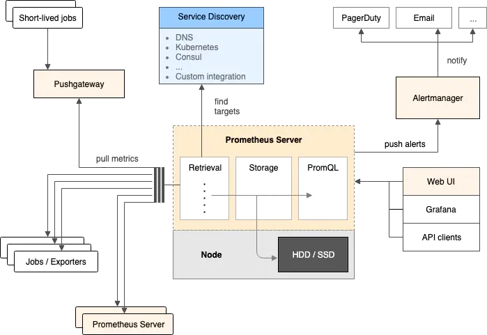
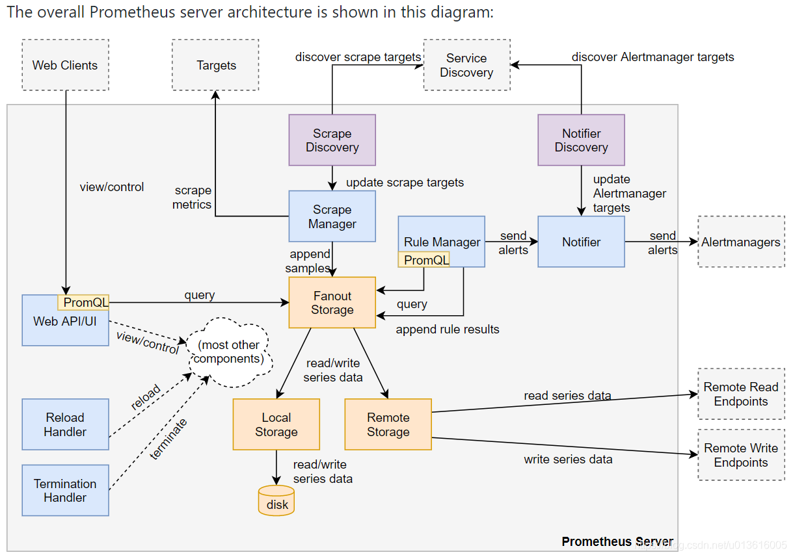
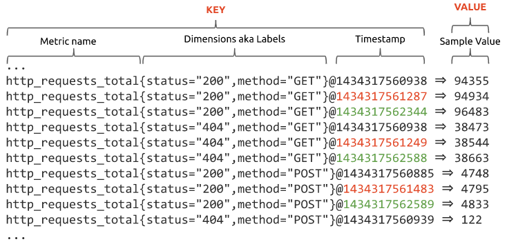

## prometheus 架构图
  Do one thing and do it well

- prometheus 通过pull的方式从采集器中拉取数据
- 采集器可以是专用的exporter，可以是一个脚本。
- prometheus 本身的功能很简单，只负责数据拉取，存储和查询功能，其他交给插件
- 通过在prometheus端设置的规则，触发告警发送到alertmanager
- prometheus有自带的web UI可以进行数据查询，第三方grafana 负责数据展示，还能通过api接口获取监控数据。

## prometheus代码结构图

## prometheus metrics

- metrics 为prometheus存储数据的最小单位，由metric name，label， timestamp，value，四部分组成。
- metric name， 在存储数据内部也是以label的形式存储的 {"__name__": "http_request_total"}
- timestamp 的数据类型为int64，value 的类型为 float64.

## 一个metric从采集到存储到处理的流程
1. 专属的采集器采集对应的监控数据
2. prometheus通过配置注册或者服务发现机制生成target
3. prometheus定期轮循（可配置）采集target中的数据。
4. 数据通过Scrap Manager组件拉取后传入TSDB 的Head块中进行存储。
5. Head块存满2h数据后存为历史数据。
