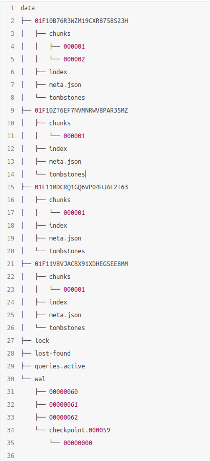
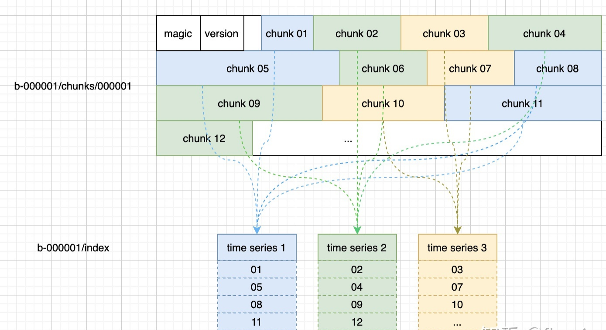

[返回](../index.md)

## TSDB 介绍

##### tsdb目录结构

##### index文件  

series 列表：记录当前 block 中有哪些 series，每个 series 有哪些 label 值，有哪些 chunks，每个 chunk 的开始、结束时间；  
倒排索引（posting）：每个 label 值到 series id 列表的倒排；  
倒排索引的 offset table：每个倒排列表的起始 offset；  
toc：index 文件中各部分的起始 offset；  

