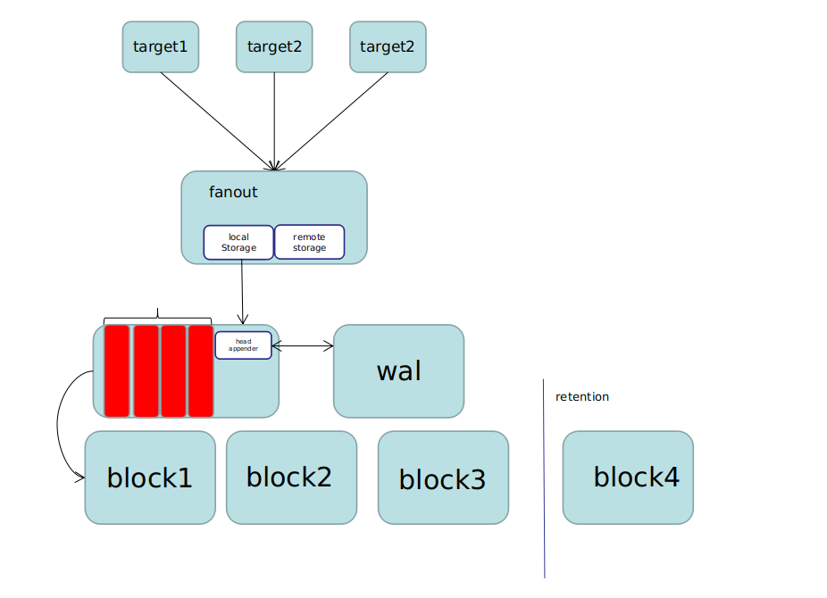
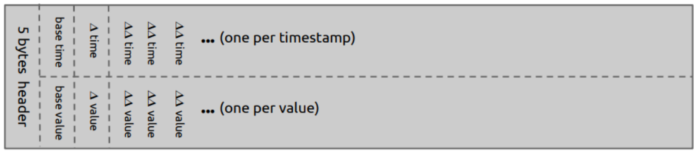
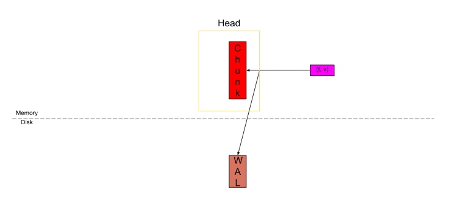
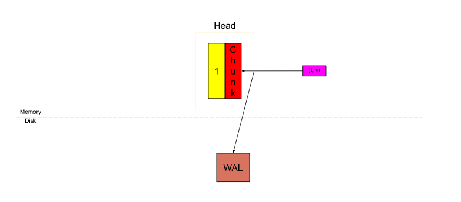
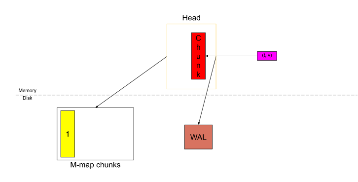
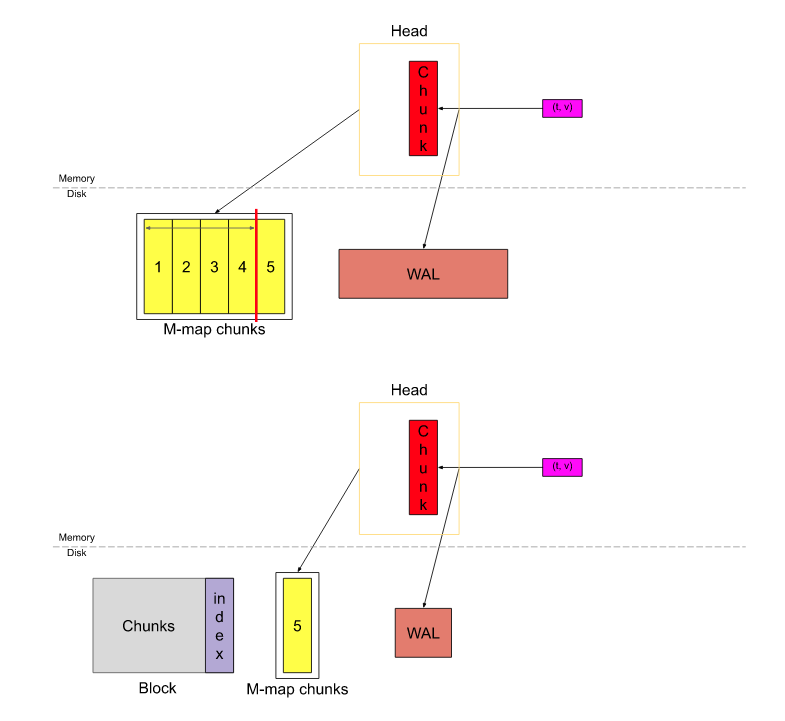

[返回](../index.md)

# TSDB 数据存储流程及数据压缩过程


### ScrapeManager 管理targets, 每一个target 生成一个 ScrapePool.

关键协程及关键函数
```
- prometheus/main.go

//生成 scrapeManager 传入fanoutStorage
scrapeManager = scrape.NewManager(log.With(logger, "component", "scrape manager"), fanoutStorage)


- scrape/manager.go 

// 每一个 targetSet 生成一个scrapeLoop, m.append 即为传入的fanoutStorage
    newScrapePool(scrapeConfig, m.append, m.jitterSeed, log.With(m.logger, "scrape_pool", setName)

- scrape/scrape.go
    同步所有的scrapePool
    go func(sp *scrapePool, groups []*targetgroup.Group) {
        sp.Sync(groups)
        wg.Done()
    }(m.scrapePools[setName], groups)
    

    每一个target运行一个协程执行进行抓取动作
    go l.run(interval, timeout, nil)
    
// appender 追加并提交抓取到的数据    
1.    sl.scrapeAndReport(interval, timeout, last, scrapeTime, errc)

2.    app := sl.appender(sl.parentCtx)

3.    sl.append(app, b, contentType, appendTime)
    
4.    app.Append(ref, lset, t, v)

5.    app.Commit()
```

### HeadAppender 追加数据到Head中。

- 通过label生成唯一的ID(metric name 也是label的一部分，以{"\_\_name\_\_"= "$name"}的形式存储)，如果ID存在，追加到series的头部。如果ID不存在， 生成新的series。
- commit 之前追加写入数据到wal 中。


### Head 存储流程
- Prometheus 新采集的样本都会存到 Head block, 其中每一个 series 会存到唯一对应的压缩单元(即 chunk) 里. 为了防止 Prometheus 挂了导致内存中的数据丢失, 新采集到的数据还会写到预写日志中.如下图：


- 自 Prometheus v2.19.0 之后, 当一个 chunk “已满” 时, 它就会被刷新到磁盘中, 并从磁盘中进行内存映射（memory-map）, 仅在内存中存储一个它的引用. 有了内存映射, 可以再需要的时候通过引用动态地将 chunk 加载到内存中, 这是操作系统提供的特性, 参考: https://en.wikipedia.org/wiki/Mmap.


- 当 Head 中的数据跨度达到 3h 时（mmap 中数据的时间跨度）, 则最久的两个小时的数据(即上图的 1~4)将被压缩成一个block.

- 每隔两小时截取一个新的block后保存到数据库中
- 截取header的同时删除wal
- 每隔一分钟检测过期数据并删除， 检测块状态， 如果有损坏则退出。

### Compact
- plan 挑选出能够被压缩的块
- 块压缩合并块 meta.json
- 合并块后生成新的 block，生成新的uid
