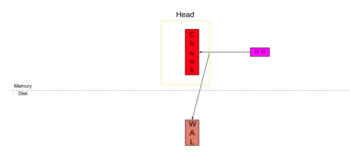

[返回](../index.md)

###WAL

1. wal全称 write ahead log, 在数据写入数据库之前，一份写入内存，另外将一份数据写入到wal中，当prometheus意外重启，prometheus启动时会读取wal中的数据以恢复数据在内存中的状态。

2. wal 文件中的数字名称的文件称为segment，默认为128MB， 可通过配置文件中的 segmentsize字段 配置segment文件大小。

3. wal截断，wal截断是在head块被截断后立即完成的，head块会截断出一个block， 生成新的block 保存到数据库中， 与此同同时wal目录也会同步截断wal文件

4. wal 不进行重压缩，因此， wal（默认启用）提供了snappy 压缩记录的选项。 可通过配置选择启用或禁用压缩。
&emsp;
#### WAL文件结构
```
data
└── wal
    ├── 000000
    ├── 000001
    └── 000002
```
文件名称是逐个增加的，文件名称越大表示文件越新。  
&emsp;
####checkpoint

在截断WAL之前， 需要在要删除的WAL segment 中创建一个 checkpoint， checkpoint 操作将按照顺序检查wal中的所有segment:  
1.删除已不存在于head中的所有wal  
2.删除在T时间之后的所有sample  
3.删除T时间之前范围内的所有逻辑删除记录  
4.以与在WAL中发现的相同方式保留剩余的series， samples和tombstone。  
删除之后的checkpoint看起来像是另一个wal目录.

``` 
data
 └── wal
    ├── checkpoint.000003
    |   ├── 000000
    |   └── 000001
    ├── 000004
    └── 000005
```
如果有旧的checkpoint， 此时将其删除。

####WAL重载
checkpoint.x 告诉我们从哪里开始加载wal目录, x+1, 表示第一个开始加载的 wal segment.  
&emsp;
 
####WAL写入


samples 写入header 写入一份到head(内存中的头block)中，追加写入一份到wal中。 写入后每达到一个segment大小后及写入.

写入部分 2.19 之后版本与之前版本有变化，需要详细说明。